# HOW TO ORDER THIS PCB

This guide is on revision `v1.1.0`.

Ordering the board will vary from distributor to distributor; some will take the
KiCAD project directly, others require Gerber files. If they require gerber
files, some will require specific naming conventions for each layer.

## Ordering Instructions: JLCPCB

Our preferred manufacturer (or at least mine) of choice is JLCPCB. They
manufacture hobby boards cheaply and quickly, and at relatively high quality
compared to other fab houses.

JLCPCB will manufacture 5 PCBs for 2$ (sans shipping and handling) if the PCBs
are <= 100mm * 100mm. They also have an SMD assembly surface where one side of
the PCB is populated, often for very cheap prices compared to the amount of
labor you would have to put in to solder all the components on.

For this PCB (Sunscatter), we will order from JLCPCB and also do SMD assembly
from them. KiCAD has nice, open source extensions that can quickly create build
files that JLCPCB will accept for manufacturing and assembly.

### Preparing the Gerbers

First make sure that the JLCPCB plugin is installed via the Plugin and Content
Manager.

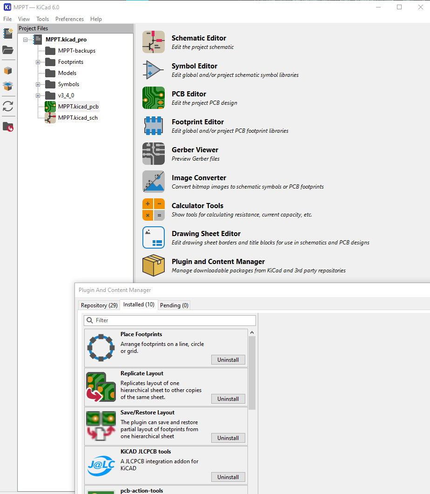

Then make sure your schematic symbol table has following columns populated for
each component:
- Value
- Reference
- Footprint
- JLCPCB BOM
- LCSC Part

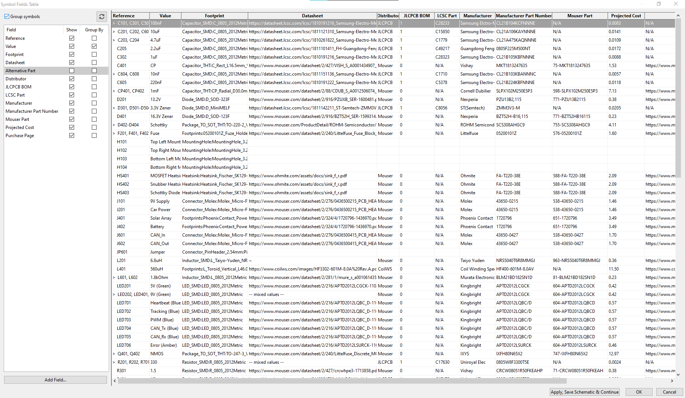

Go to the PCB editor, and after the layout finishes and everything passes DRC
click on the JLCPCB button.

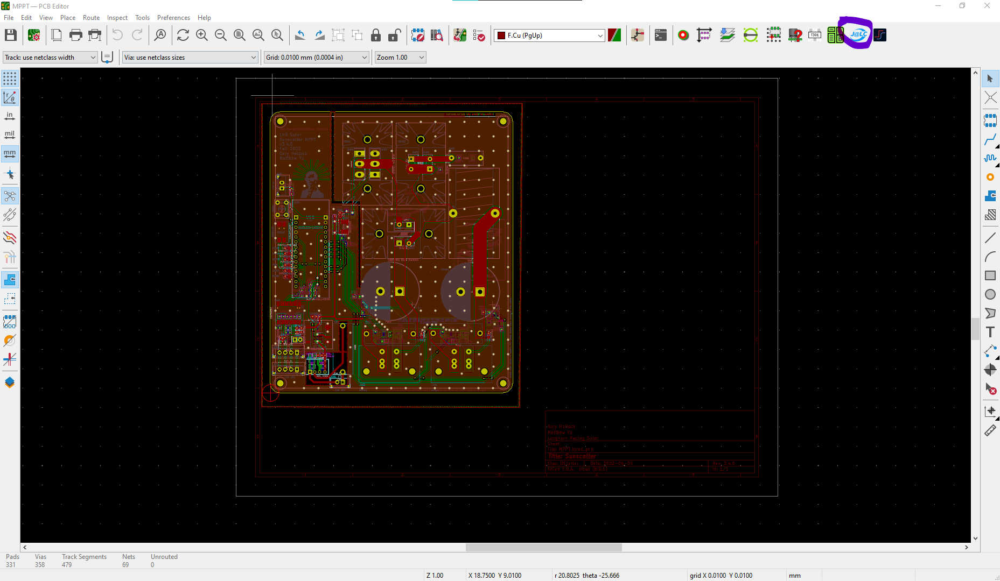

Finally generate the fab files using the Generate Fabrication Files button. Make
sure the BOM and POS have a checkmark for all components you want assembled by JLCPCB.

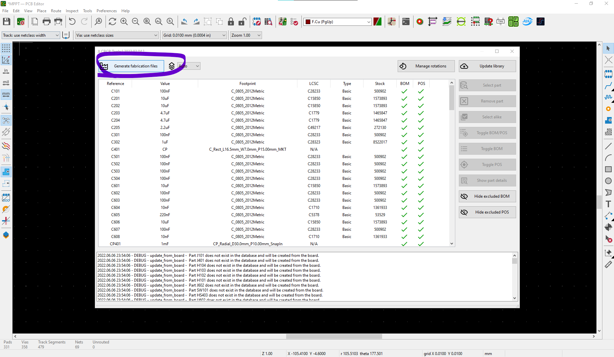

### Ordering from JLCPCB

After the gerbers are generated properly, head onto the JLCPCB
[site](jlcpcb.com).

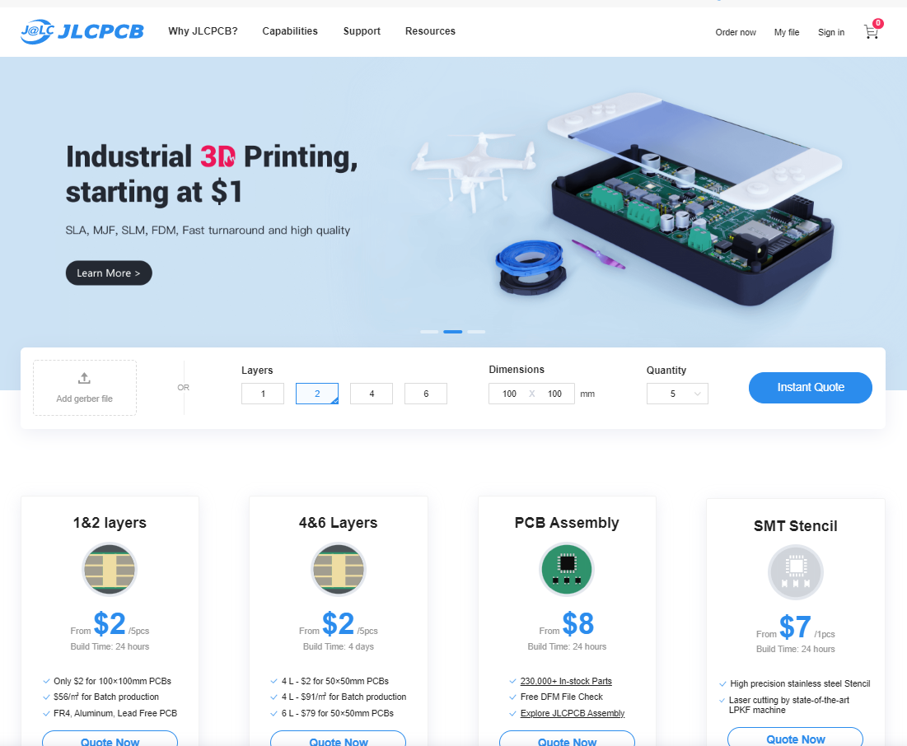

Go and get a quote.

If you press the add gerber file button, you can upload the output gerber files.
They are found in the `jlcpcb/assembly/gerber` folder as `GERBER-xxx.zip`.

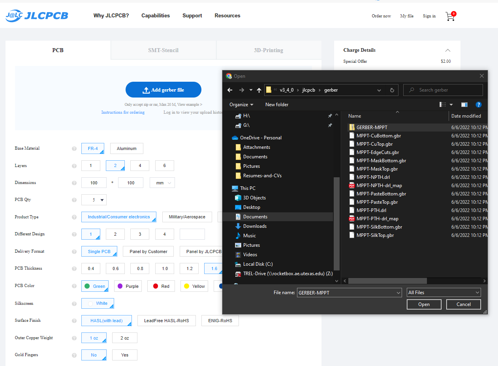

The webpage will load the gerbers, if they are in the correct format and board
passes some checks it'll show up. The dimensions of the board will be updated
and a new quote price will be displayed.

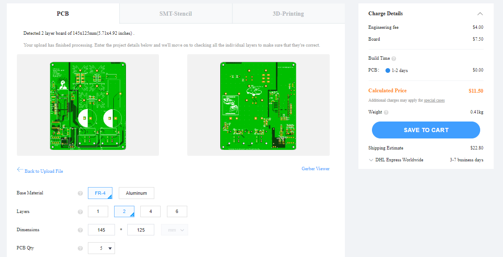

We can then go down the screen and enable the PCB assembly option. We can choose
which side we want to assemble and the number of boards to assemble (2 or 5).

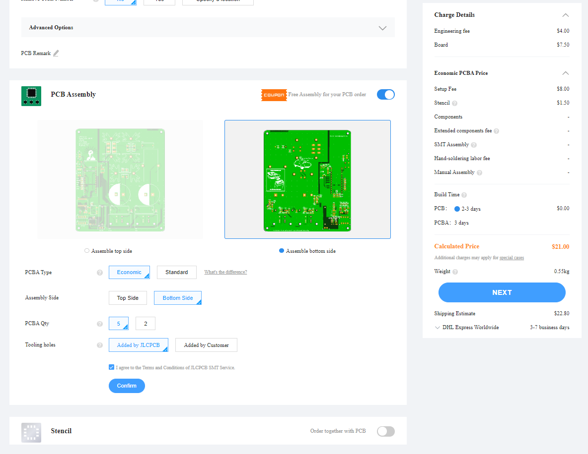

The next page after hitting confirm asks for a BOM and CPL file, the latter is
the position of the components to be assembled on the board. We can find those
as `jlcpcb/assembly/BOM-xxx.csv` and `jlcpcb/assembly/POS-xxx.csv` respectively.

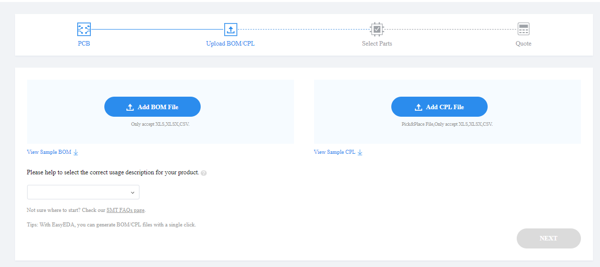

The next page will load the BOM and check against the LCSC internal database and
match all available components. We prefer basic components since every extended
component is an extra 2$ fee per type to manually load.

The next page reviews the PCB, you can zoom in on the screen to see where each
component will be placed. Make sure it matches or the engineer who inspects the
files will send an email back with complaints and the order will be delayed.

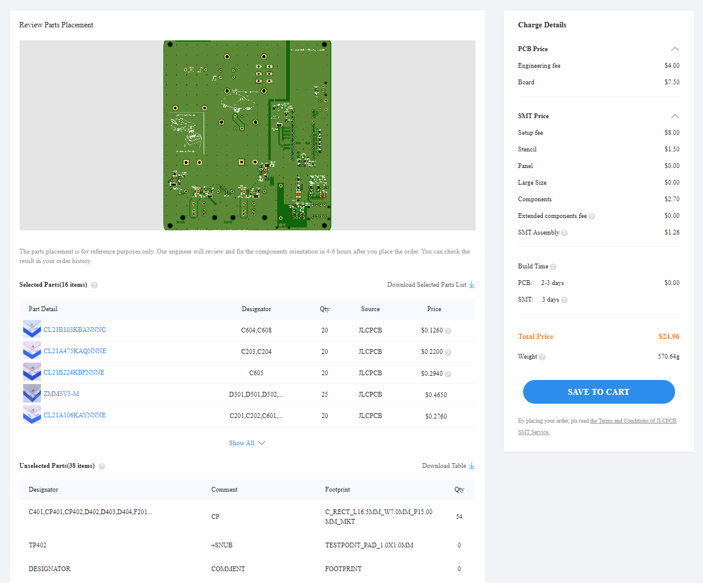
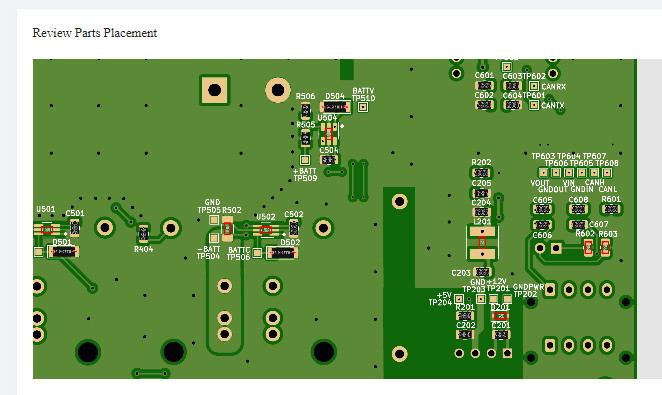

Finally you can save the order to the cart, review everything, and order it.
Feel free to select the delivery system that best fits your timeline and the
budget, and use any coupons if you have any.

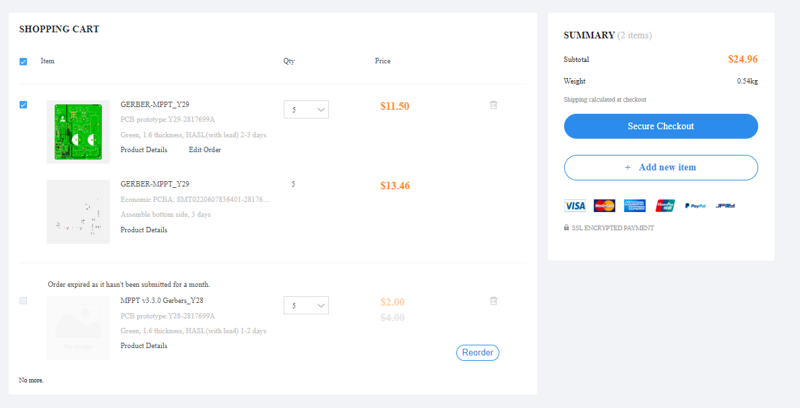
